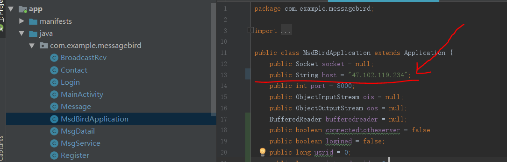
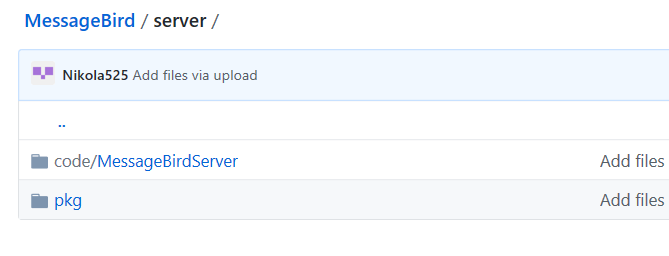

# MessageBird

Introduction

  This Android application was designed to give its users the ability to communicate with each other on the Internet. It provides the some useful and fundamental functions like sending text message to the partner, adding a new partner account. 

Features

1.	Sending a message to the partner wherever you can access the internet.
2.	Adding a more partner account to your app.
3.	Getting noticed when having a new message to you.

How to install and configure it.

  A server is needed to support the application to achieve its functionality. A good news is that the developer has deployed a server on the internet. So, the application can been download and install directly on the android( minSdkVersion=21, means android 5.0 and above) smartphone like other android application. If the application always can’t connect to the server, an email should send to ？ for asking. Or the user can deploy a new server and change the “host” string(see the picture below) to the ip address of the host on which the server has been deployed and is running.
  
 

Note:
  The server program is in the server folder in the application projects on the github. And into the server folder, the pkg folder hold the jar file and lib as well as the code folder hold the netbeans project of the server. It’s looks like the following. 
   
 

